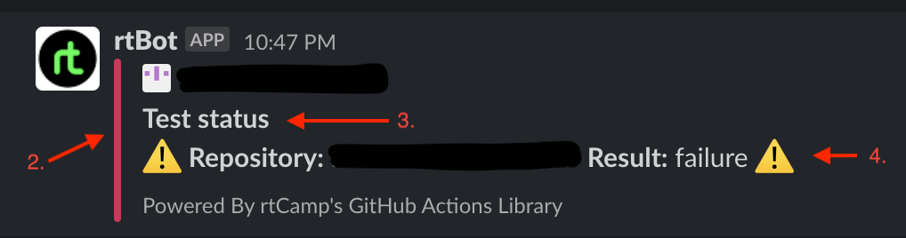
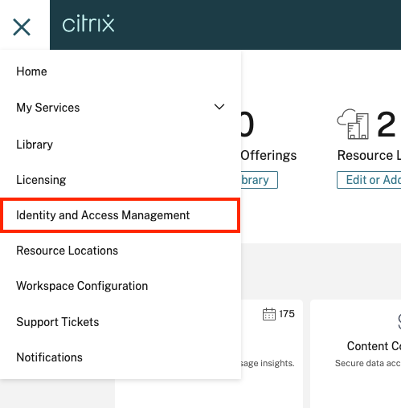
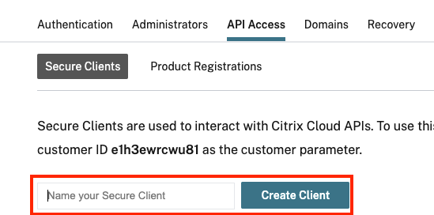
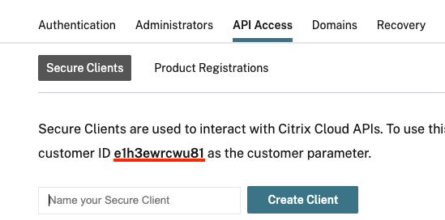
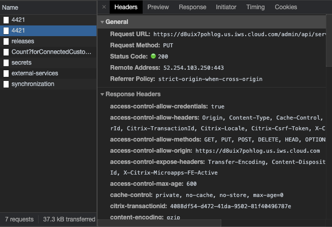
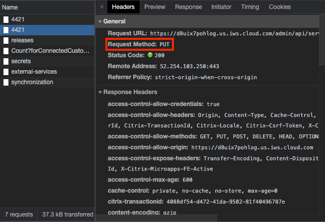
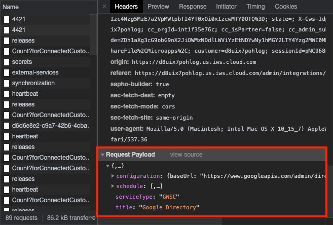
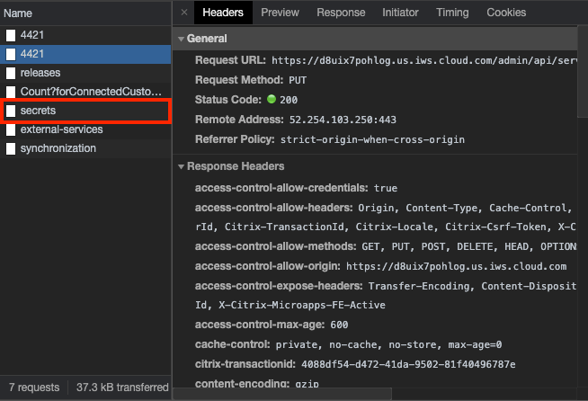
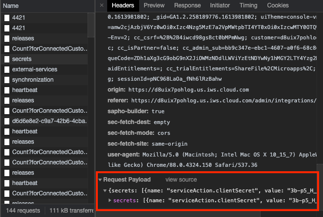

# Automation template [](https://github.com/citrix-workspace/automation-template/blob/master/LICENSE)

 Automation template contains boilerplate code and directory structure and together with the [microapps-automation-helper](https://www.npmjs.com/package/) should help you to write automated tests for your [Microapps](https://docs.citrix.com/en-us/citrix-microapps.html) with minimum configuration.


## About this project


[Related projects we use](#related-projects-we-use)

[Getting Started](#getting-Started)

[Github Actions](#github-Actions)

[Citrix Cloud API Access](#citrix-cloud-api-access)

[Setup Integrations](#setup-integrations)

[Generic Tests](#generic-tests)

[Test Examples](#test-examples)

[Best Practices](#best-practices)

## Related projects we use

-   [TypeScript](https://www.typescriptlang.org/docs)
-   [Jest](https://jestjs.io/docs/en/getting-started)
-   [Prettier](https://prettier.io/docs/en/index.html)
-   [Playwright](https://playwright.dev/)
-   [dotenv](https://github.com/motdotla/dotenv#readme)

## Getting Started

#### Installation

```bash
yarn
```

##### How to handle local secrets

To be able to load your env variables, you can create your own config:

```
touch .env
```

Example of .env

```
CONFIG_WORKSPACE_USERNAME=jon@doe.com
CONFIG_WORKSPACE_PASSWORD-myP@ssword1
```

:warning: Don`t commit .env file into repository - you can add .env to .gitignore and now you can run yor test

#### Running All Tests locally

```bash
yarn jest src/__tests__ --setupFiles dotenv/config
```

#### Running Single Test locally with env config

```bash
yarn jest src/__tests__/example.test.ts --setupFiles dotenv/config
```

## Github Actions

[Setting up workflow before first use](#setting-up-workflow-before-first-use)

[Setting up your own workflow](#setting-up-your-own-workflow)

[Running only specific tests with Github Actions](#running-only-specific-tests-with-github-actions)

Github Actions is used for running tests in workflow. Workflow file is located in `.github/workflows` where is `e2e-tests.yml`

In the `e2e-tests.yml` workflow are basic steps which includes:

-   Seting up the pipeline and installing all dependencies
-   Exporting secrets
-   Running tests
-   Uploading artifacts (screenshots, logs)
-   Sending notifications to Slack
-   Sending report to PowerBI

### Setting up workflow before first use

To be able to successfully use the workflow, you need to set it up first.

Exporting Github Secrets

-   For each Github Secret you want to use in your tests, the secret needs to be exported.
-   The secret is exported by adding this line

    ```yml
    echo 'VARIABLE=$({ secrets.SECRET })' >> $GITHUB_ENV;
    ```

    in Export secrets step under run command, where you put instead:

    1. `VARIABLE` -> variable name, which you are using/will be using in tests
    2. `SECRETS` -> secret name under which is secret stored in Github Secrets

-   After exporting all needed secrets the step should look like this

    ```yml
    - name: Export secrets
      run: |
          echo 'VARIABLE1=$({ secrets.SECRET1 })' >> $GITHUB_ENV;
          echo 'VARIABLE2=$({ secrets.SECRET2 })' >> $GITHUB_ENV;
          echo 'VARIABLE3=$({ secrets.SECRET3 })' >> $GITHUB_ENV;
          echo 'VARIABLE4=$({ secrets.SECRET4 })' >> $GITHUB_ENV;
      shell: bash
    ```

    There is already a one export line, how the export of a Github Secret should look like. You can use it as a template and delete it after

### Setting up your own workflow

[Slack Notification](#slack-notifications)

[Sending report to PowerBI](#sending-report-to-powerbi)

For better understanding how to setup workflow please go to [Github documentation for Github Actions](https://docs.github.com/en/actions/reference/workflow-syntax-for-github-actions), but it is advised to use/copy the predefined workflow.

#### Slack Notification

The step for sending Slack Notification should have format like this

```yml
- name: Send Notification to Slack
  uses: rtCamp/action-slack-notify@master
  env:
      SLACK_CHANNEL: wsi-factory-test-results
      SLACK_COLOR: '#80FF33'
      SLACK_TITLE: Test status
      SLACK_MESSAGE: ':success-icon: *Repository:* ${{ github.event.repository.name}}  *Result:* ${{ job.status }} :success-icon:'
      SLACK_WEBHOOK: ${{ secrets.SLACK_WEBHOOK }}
      MSG_MINIMAL: false
```

If you want to make different notifications for successful and failed run, make 2 of these steps but for the failure one add this line between the `name` and `uses`

```yml
if: ${{ failure() }}
```

The env params:

1.  `SLACK_CHANNEL` - Channel where the notification will be sent
2.  `SLACK_COLOR` - Color in HEX which will determine the side line color of the notification
3.  `SLACK_TITLE` - Title of the notification
4.  `SLACK_MESSAGE` - Text that will be sent with the notification
5.  `SLACK_WEBHOOK` - A webhook needed for connection to the slack



#### Sending report to PowerBI

The step for sending report to PowerBI should look like this

```yml
- name: Send Report to Power BI
  if: always()
  run: |
      echo $startDate
      export serverVersionrTest=$(curl -k -s https:///hotsvcnv6xdz.us.iws.cloud.com/status/up | jq -r '.version')
      echo $serverVersionrTest
      export runNumber="${{ github.run_number }}"
      export workflowName="${{ github.workflow }}"
      export repositoryName="${{ github.event.repository.name}}"
      export endDate=$(date -u +"%Y-%m-%dT%H:%M:%SZ")
      cat artifacts/report.json | jq  -r --arg buildID "$runNumber" --arg jobName "$workflowName" --arg integrationName "$repositoryName" --arg startTime "$startDate" --arg endTime "$endDate" --arg serverVersionrTest "$serverVersionrTest" \
          '[{ 
          "buildID":($buildID)|tonumber,
          "startTime":$startTime,
          "customerIDCC":"hotsvcnv6xdz",
          "versionMAServer":$serverVersionrTest,
          "integrationName":$integrationName,
          "passed":.numPassedTests,
          "failed":.numFailedTests,
          "skipped":.numPendingTests,
          "total":.numTotalTests,
          "endTime":$endTime,
          "jobName":$jobName,
          }]' > report_power_bi.json
      cat report_power_bi.json
      curl --include \
          --request POST \
          --header "Content-Type: application/json" \
          --data-binary @report_power_bi.json \
          "${{ secrets.POWER_BI_API_KEY }}"

  shell: bash
```

It takes values from report.json file in artifacts generated by the end of test runs + values from github workflow and sends it to the PowerBI dependant on which `POWER_BI_API_KEY` is assigned

If the report patern doesnt match the patern in your PowerBI report, you must change it based on your PowerBI pattern here:

```yml
'[{
"buildID":($buildID)|tonumber,
"startTime":$startTime,
"customerIDCC":"hotsvcnv6xdz",
"versionMAServer":$serverVersionrTest,
"integrationName":$integrationName,
"passed":.numPassedTests,
"failed":.numFailedTests,
"skipped":.numPendingTests,
"total":.numTotalTests,
"endTime":$endTime,
"jobName":$jobName,
}]'
```

### Running only specific tests with Github Actions

There is a field named `Test map` which is generaly empty and that means all tests will be run.

-   To run just one test type in the field `FIXTURE_NAME` of the test <b>---></b> `_Example_`
-   To run two or more tests, but not all, type there all `FIXTURE_NAME`s seperating them with `|` <b>---></b> `_Example_|_Example2_|_Example3_`

If you want to define default list of tests to always appear in the field `Test map`, edit the .yml file you are using at `on > workflow_dispatch > inputs > testList > default`:

```yml
on:
    workflow_dispatch:
        inputs:
            testList:
                description: 'Test map'
                required: false
                default: #here -> '_Example_|_Example2_|_Example3_'
```

So it should look like this:

```yml
on:
    workflow_dispatch:
        inputs:
            testList:
                description: 'Test map'
                required: false
                default: '_Example_|_Example2_|_Example3_'
```

## Citrix Cloud API Access

To be able to use Citrix Cloud and Microapps Admin APIs, you need to get Client ID, Client Secret, Customer ID and cwaAPI

-   After logging in with user that will be used by tests to Citrx Cloud, open menu on the upper left hand side and go to Identity and Access Management



-   Go to API Access page, put some name and click on <b>Create Client</b>



1. Client ID and Client Secret

    - Right after clicking on <b>Create Client</b>, Client ID and Client Secret will be shown. You can copy both or download them in .csv file by clicking on download. This is only chance to copy the Client Secret

2. Customer ID

    - Can be found in the text over the <b>Create Client</b> space.

    

3. cwaAPI

    - If the Customer, where tests will be run, is in STAGE
        - `cwaAPI` = ctxwsstgapi
    - If the Customer, where tests will be run, is in PROD
        - `cwaAPI` = citrixworkspacesapi

-   After getting all neccessary values you can get Bearer token and create Authentication instance by using the functions in Citrix Cloud class from Microapp Automation Helper package.

    ```ts
    let bearerToken: string;
    let authInstance: string;

    const { customerId, cwaAPI, clientId, clientSecret } = config;

    bearerToken = await citrixCloud.getCCBearerToken({
        cwaAPI,
        citrixCloudCustomerId: customerId,
        citrixCloudClientId: clientId,
        citrixCloudClientSecret: clientSecret,
    });

    authInstance = await citrixCloud.createAuthInstance({ bearerToken });
    ```

## Setup Integrations

[How to get Integration Configuration payload](#how-to-get-integration-configuration-payload)

[How to get Secrets payload](#how-to-get-secrets-payload)

[Matrix](#matrix)

[Running the script](#running-the-script)

The setupIntegration in `setupIntegrations.ts` file is for creating new integration in Microapps Admin

For successfully setting up new Integrations with the script you will need:

1. Get integration configuration payload
2. Get secrets payload
3. Setup Matrix

### How to get Integration Configuration payload

To get the payload, you will need to create the integration manually.

1. Go to Microapps Admin
2. Start setting up your integration and enter all missing data (credentials, url, etc.)
3. Open developer tools and go to Network page
4. Click save to complete the integration setup
5. After that in the network developer tools requests should start to pop up. Requests named with just a number, secrets, external-services and synchronization for example.



6. You will need one of the number named requests and the one you will need is request with Request Method PUT



After you find the right request, scroll down until there is Request Payload



Click on view source and there you have the entire payload ready for copy

### How to get Secrets payload

_You can skip steps 1-5 if you were getting integration configuration payload and you can find the secrets request_

1. Go to Microapps Admin
2. Start setting up your integration and enter all missing data (credentials, url, etc.)
3. Open developer tools and go to Network page
4. Click save to complete the integration setup
5. After that in the network developer tools requests should start to pop up. Requests named with just a number, secrets, external-services and synchronization for example.


6. You will need the Secrets named request



After you find the right request, scroll down until there is Request Payload



Click on view source and there you have the entire payload ready for copy

### Matrix

You will need to seup a matrix in `src/data/matrix.js` file.
There is already a pre-defined one, you just need to enter missing data.

1. name - Name of the integration
2. pathToFile - Copy a name of imported integration .mapp file and replace the \*\*
3. configuration - Copy the integration configuration payload and paste it here
4. secrets - Copy the secrets payload and paste it here. Replace the values with values that will be taken from Github Secrets
5. microapps - This is place for all microapps the integration has. Few examples are in the base matrix already, so you will need to just replace the microapps1/microapps2 with the real name of Microapp and inside the subscribers array add real test user's emails

### Running the script

When everything is ready, the script won't run until the `shouldConfigureIntegrations` value in `config.ts` file will be set to `true`.

- When `shouldConfigureIntegrations` is set to `true`, a new integration will be created before every run of a workflow or even when you run just one test localy
- If you don't want this to happen, set `shouldConfigureIntegrations` as `false` <i>(recommended while in development of a new code)</i>

## Generic Tests

Generic tests are checking if Integrations in Microapps Admin are ready for testing.

There are 2 generic tests:

1. genericMisconfigurationIntegration

    - Gets all Integrations and its Microapps that are on the Environment
    - Searches in their configs if everything is alright
    - Creates a report in a JSON file
    - If at least one Integration is misconfigured, the test will fail

2. genericSynchronization
    - Gets all Integrations that are on the Environment
    - Filters out those which are misconfigured
    - On the rest tries to start Incremental Synchronization and then Full Synchronization
    - Creates a report in a JSON file
    - If at least one Integration has one failing synchornization, the test will fail

You can run both tests by running the `generic-tests.yml` workflow.
Also by running the workflow, both JSON reports will be put in one and sent to PowerBI dashboard

## Test Examples

[Create Test](#create-test)

[Update Test](#update-test)

### Create Test

```ts
// Class for APIs accessing the System of Record (eg. salesforceAPI)
const sorAPI = new sorAPI();
const workspace = new Workspace();

const { workspaceUrl, identityProvider, customerId, cwaAPI, clientId, clientSecret } = config;

describe(FIXTURE_NAME, ('_Create record_') => {
    let ticketId: string;
    let sorBearerToken: string;
    let testidentificator: string;

    it(FIXTURE_NAME, async ({ context, page }) => {
        await step(context)('Get MS CRM token', async () => {
            sorBearerToken = await sorAPI.getBearerToken({});
        });

        await step(context)('Login to Workspace', async () => {
            await workspace.login({
                page,
                url: workspaceUrl,
                username: workspaceUsername,
                password: workspacePassword,
                idp: identityProvider,
            });
        });

        await step(context)('Go to Actions', async () => {
            await workspace.goToActions({ page });
        });

        await step(context)(`Click Action ${actionName}`, async () => {
            await workspace.startAction({ page, actionName, integrationName });
        });

        await step(context)('Fill in all necessary information', async () => {
            testIdentificator = 'Create record test';

            await page.waitForSelector(selector);
            await page.click(selector);

            await page.waitForSelector(selector2);
            await page.type(selector2, testIdentificator);
        });

        await step(context)('Submit record', async () => {
            await page.waitForSelector('footer button:not([disabled])');
            await page.click('footer button:not([disabled])');
        });

        await step(context)('Get Record ID', async () => {
            const response = await page.waitForResponse(
                (response: { url: () => string; status: () => number }) =>
                    response.url().match(new RegExp(config.loggerFilter)) && response.status() === 200
            );
            const responseJSON: any = await response.json();
            ticketId = responseJSON.processedRecords[0].recordId.issue_key;
        });

        await step(context)('Wait for PopUp to display success message', async () => {
            await workspace.waitForPopUp({
                page,
                text: 'Your request will be processed in',
            });
        });

        await step(context)('Check if the record was submited with API', async () => {
            const verification = await sorAPI.checkRecordSubmited({ sorBearerToken, ticketId });
            expect(verification.status).toEqual(200);
        });
    });
    afterAll(async () => {
        await run('Delete the Record', async () => {
            const respDelete = await sorAPI.deleteRecord({ sorBearerToken, ticketId });
            await expect(respDelete.status).toEqual(204);
        });
    });
});
```

### Update Test

```ts
import { Workspace, MicroappsAdmin } from "microapps-automation-helper";

// Class for APIs accessing the System of Record (eg. salesforceAPI)
const sorAPI = new sorAPI();
const workspace = new Workspace();
const microappsAdmin = new MicroappsAdmin()

const { workspaceUrl, identityProvider, customerId, cwaAPI, clientId, clientSecret, builderUrl } = config;

describe(FIXTURE_NAME, ('_Update record_') => {
    let ticketId: string;
    let sorBearerToken: string;
    let testIdentificator: string;

    it(FIXTURE_NAME, async ({ context, page }) => {
        await step(context)('Get SoR token', async () => {
            sorBearerToken = await sorAPI.getBearerToken({});
        });

        await step(context)('Create Record in SoR with API', async () => {
            testIdentificator = 'Update record test';

            const createRecord = await sorAPI.createRecord({ sorBearerToken, testIdentificator });

            ticketId = createRecord.data.record_id;
        });

        await step(context)('Get Citrix Cloud token', async () => {
            bearerToken = await citrixCloud.getCCBearerToken({
                cwaAPI,
                citrixCloudCustomerId: customerId,
                citrixCloudClientId: clientId,
                citrixCloudClientSecret: clientSecret,
            });
        });

        await step(context)('Create Authorization instance for Citrix Cloud', async () => {
            authInstance = await citrixCloud.createAuthInstance({ bearerToken });
        });

        await step(context)('API OAuth logout', async () => {
            await microappsAdmin.oauthLogout({ authInstance, microappsAdminUrl: builderUrl, integrationName });
        });

        await step(context)(`Run  ${synchronizationType}`, async () => {
            await microappsAdmin.runSynchronization({
                authInstance,
                microappsAdminUrl: builderUrl,
                integrationName,
                synchronizationType,
            });
        });
        await step(context)('Login to Workspace', async () => {
            await workspace.login({
                page,
                url: workspaceUrl,
                username: workspaceUsername,
                password: workspacePassword,
                idp: identityProvider,
            });
        });

        await step(context)('Wait for loading feedcards', async () => {
            await page.waitForSelector('#notification-home-feed-cards', {});
        });

        await step(context)('Wait for Feed Card', async () => {
            feedCardId = await workspace.waitForFeedCardId({ page, recordId: leadId });
        });

        await step(context)('Open blade', async () => {
            await page.waitForSelector(`#feed-card-body-${feedCardId}`);
            await page.click(`#feed-card-body-${feedCardId}`);
        });

        await step(context)('Edit Record', async () => {
            await page.waitForSelector(selector);
            await page.click(selector);

            await page.waitForSelector(selector2);
            await page.type(selector2, testIdentificator);
        });

        await step(context)('Submit record', async () => {
            await page.waitForSelector('footer button:not([disabled])');
            await page.click('footer button:not([disabled])');
        });

        await step(context)('Wait for PopUp to display success message', async () => {
            await workspace.waitForPopUp({
                page,
                text: 'Your request will be processed in',
            });
        });

        await step(context)('Check if the record was submited with API', async () => {
            const verification = await sorAPI.checkRecordSubmited({ sorBearerToken, ticketId });
            expect(verification.data.description).toEqual(testIdentificator);
        });
    });
    afterAll(async () => {
        await run('Delete the Record', async () => {
            const respDelete = await sorAPI.deleteRecord({ sorBearerToken, ticketId });
            await expect(respDelete.status).toEqual(204);
        });
    });
});
```

## Best Practices

[Examples for working with Workspace contents](#examples-for-working-with-workspace-contents)

[Examples for working with Blade contents](#examples-for-working-with-blade-contents)

[Examples for working with FeedCard contents](#examples-for-working-with-feedCard-contents)

[Example of screenshot comparation](#example-of-screenshot-comparation)

[Example of starting an Integration Synchronization](#example-of-starting-an-integration-synchronization)

[Examples of how to wait for some Element to appear](#examples-of-how-to-wait-for-some-element-to-appear)

### Examples for working with Workspace contents

#### Click on Action in Actions in Workspace

```ts
const workspace = new Workspace();

await workspace.startAction({ page, actionName, integrationName });
```

### Examples for working with Blade contents

#### Select Option and check if correct value is selected

```ts
await page.selectOption(selector, value);

const selectValue: any = await page.$(selector);

expect(await selectValue.evaluate((element: HTMLSelectElement) => element.value)).toEqual(value);
```

#### Using Look-Up component

```ts
await page.type(selector, text);

const environmentUrl = config.microappsAdminUrl.replace('/admin', '');

await page.waitForResponse(
    (response: { url: () => string; status: () => number }) =>
        response.url().includes(`${environmentUrl}/app/api/app`) && response.status() === 200
);

await page.press(selector, 'Enter');
```

#### Waiting until button is not disabled

```ts
await page.waitForSelector('footer button:not([disabled])');
```

#### Rewrite already filled text label

```ts
await page.fill('[data-testid="integration-name"]', '');
await page.type('[data-testid="integration-name"]', integrationName);
```

### Examples for working with FeedCard contents

#### Get FeedCardID for future localization of the FeedCard

```ts
const workspace = new Workspace();

const feedcardId = await workspace.waitForFeedCardId({ page, recrodId });
```

#### Click on Button on FeedCard

```ts
const workspace = new Workspace();

const button = await workspace.getFeedCardButton({ page, feedCardId, buttonName });

await button[0].click();
```

### Example of screenshot comparation

For screenshot testing we are using tool Jest Image Snapshot
This tool is comapring actual state of a page or page component with saved image
During the first run the benchmark image is created. This image has to be check if the UI is in demanded state

```ts
describe(FIXTURE_NAME, () => {
    it(FIXTURE_NAME, async ({ context, page }) => {
        const testIdentificator = getTestId();
        console.log(testIdentificator);

        await step(context)('Login to Workspace', async () => {
            await workspaceUi.login({
                page,
                workspaceUrl,
                workspaceUsername: username,
                workspacePassword: password,
                workspaceIdentityProvider: idp,
            });
        });

        await step(context)('Go to Action page', async () => {
            await workspaceUi.goToActions({ page });
        });

        await step(context)('Click on "Create Account" MicroApp', async () => {
            await workspaceUi.startAction({ page, actionName: 'Create Account' });
        });

        await step(context)('Wait for Blade to load', async () => {
            await page.waitForSelector('[data-testid="text-input-account"]');
        });

        /// this is the main part of the test, screenshot is taken a compared to the saved one

        await step(context)('Compare screenshots', async () => {
            //take a screenshot
            const screenshot = await page.screenshot();
            expect.extend({ toMatchImageSnapshot });
            expect(screenshot).toMatchImageSnapshot();
        });
    });
});
```

### Example of starting an Integration Synchronization

To start Synchronization, you need to run `runSynchronization()` function from `microappsAdmin` class from `microapps-automation-helper` package. Function description can be found [here](https://github.com/citrix-workspace/microapps-automation-helper/blob/master/API-REFERENCE.md)

```ts
import { MicroappsAdmin } from 'microapps-automation-helper';

const microappsAdmin = new MicroappsAdmin();

await microappsAdmin.runSynchronization({ authInstance, microappsAdminUrl, integrationName, synchronizationType, };
```

The function will start the synchronization and will wait until the synchronization is complete. It will throw error, if the synchronization wouldn't finish.

### Examples of how to wait for some Element to appear

Using waitForTimeout function only leads to unstability of test so you should never use this approach:

```ts
await page.click('button');

await page.waitForTimeout(5000);

await page.click('button2');
```

The test will wait everytime and only 5 seconds until it will try to find the `button2` selector. If the loading of the button will take more then 5 seconds, the `await page.click('button2');` would not find the particular selector and the test would fail. If the `button2` would appear sooner, the test would still wait until the 5 seconds would pass, so this apporach isn't efficient and can also make the test unstable. 

When test should wait for content to load, you can use either:

1. page.waitForResponse function, when you find suitable request to wait for to finish

    ```ts
    await page.click('button');

    await page.waitForResponse(
        (response: { url: () => string; status: () => number }) =>
            response.url().includes('{requestUrl') && response.status() === 200
    );

    await page.click('button2');
    ```

2. page.waitForSelector function, when you find suitable selector to wait for until it is vissible

    ```ts
    await page.click('button');

    await page.waitForSelector('selector');

    await page.click('button2');
    ```
